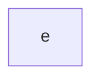

# System interaction

@import "diagrams/ripped-system.png"

# Texture Manager sets a texture set

@import "diagrams/ripped-txtmgr-makeripped.png"

# Ripped spell cycle
@import "diagrams/ripped-spell-cycle.png"

