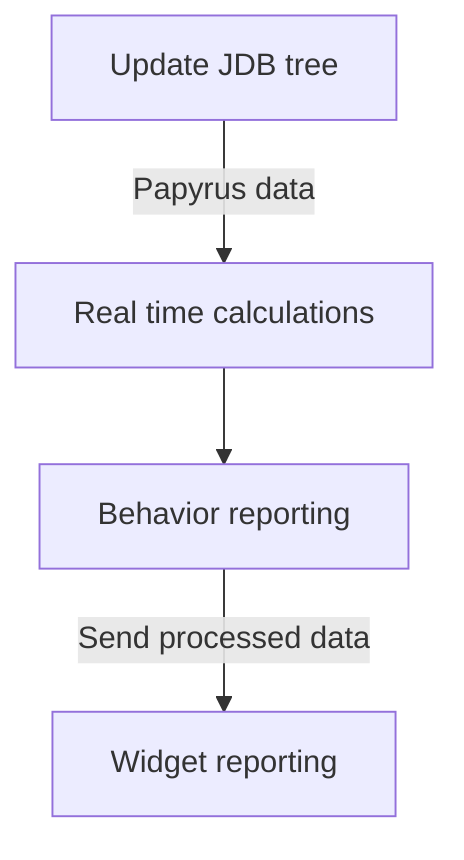

---
export_on_save:
  markdown: true

markdown:
  path: main.md
  absolute_image_path: false
---

This file needs [Markdown Preview Enhanced](https://marketplace.visualstudio.com/items?itemName=shd101wyy.markdown-preview-enhanced) to be generated. [See documentation](https://shd101wyy.github.io/markdown-preview-enhanced/).

# Real time calculations


```sequence {theme= "hand"}

Title: Here is a title
A->B: Normal line
B-->C: Dashed line
C->>D: Open arrow
D-->>A: Dashed open arrow

```
