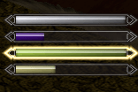

---
html:
  embed_local_images: true
  embed_svg: true
  offline: true
  toc: true

print_background: false

toc:
  depth_from: 1
  depth_to: 3
  ordered: false
---

<!-- @import "[TOC]" {cmd="toc" depthFrom=1 depthTo=6 orderedList=false} -->

<!-- code_chunk_output -->

- [Overview](#overview)
  - [Really; read this document. I promise I tried my best not to be boring](#really-read-this-document-i-promise-i-tried-my-best-not-to-be-boring)
- [Requirements](#requirements)
  - [Integrations](#integrations)
- [FAQ](#faq)
  - [My fatigue is over 9000!!!](#my-fatigue-is-over-9000)
  - [Weight gaining/getting ripped for pure mages](#weight-gaininggetting-ripped-for-pure-mages)
  - [What's the deal with the head resizing thing?](#whats-the-deal-with-the-head-resizing-thing)
  - [Could you add ripped textures for \<insert name here\> body/texture pack?](#could-you-add-ripped-textures-for-insert-name-here-bodytexture-pack)
- [The basics](#the-basics)
- [Behaviors](#behaviors)
  - [The Pumping Iron Behavior](#the-pumping-iron-behavior)
    - [Summary](#summary)
    - [Mechanics in depth](#mechanics-in-depth)
      - [Inactivity](#inactivity)
      - [Skill configuration](#skill-configuration)
    - [Status reports](#status-reports)
  - [The Sandow Plus Plus Behavior](#the-sandow-plus-plus-behavior)
    - [Summary](#summary-1)
    - [Mechanics in depth](#mechanics-in-depth-1)
      - [Fatigue](#fatigue)

<!-- /code_chunk_output -->

@import "help.less"

# Overview
Thanks for using Sandow Plus Plus! \
This mod is the result of many, **MANY** hours of hard work that sometimes required deep research... and decompiling and trying to decipher how to use obscure  undocumented files that are already quite hard to come by *per se*.

<figure>

<figcaption>The horror...</figcaption>
</figure>

The basic premise behind this mod is simple: **train and sleep to get muscular/ripped**[^bsamazons].

[^bsamazons]: If you are playing as a woman and you gain boobs instead of muscles, you may want to try [my favorite Bodyslide preset ever](https://www.nexusmods.com/skyrimspecialedition/mods/34593) (which I made myself, obviously).

Nonetheless, this mod has become so complex[^performant] and has so many options it really deserves a fully fledged help file.

[^performant]: Don't worry, though. It has always been **quite performant**.
This mod only runs when you ask it to do so, and when it does, it's by performing simple mathematical formulas.

## Really; read this document. I promise I tried my best not to be boring
I always appreciate when authors take their time to explain how to use their mods and... let us be honest: I hate when they don't bother to explain how to play their complex mods and such, so here we are.

So, let me emphasize again: **Sandow Plus Plus is complex** and you should really read this document.\
If you ever have a problem, I've most likely talked about it in this help file.

# Requirements
Boring stuff, but necessary if you don't want me to ask you to enable debugging and tracing just for you to be greeted by a message telling you [***DO YOU EVEN READ, BRO?***](https://knowyourmeme.com/memes/do-you-even-lift).

<figure>

<figcaption>Why, of course I'm not joking!</figcaption>
</figure>

## SKSE + SkyUI  {ignore=true}
A must have for most mods, anyway.

## JContainers  {ignore=true}
***THIS IS NOT OPTIONAL***. I repeat: **THIS IS NOT OPTIONAL**.

Starting from v4.0 and on, this mod relies on the Lua programming language; and the only way to get Lua working in Skyrim is using ==JContainers==.

Long story short: this mod will simply fail to work if you don't use JContainers.

## RaceMenu/PapyrusUtil  {ignore=true}
These are required only if you want to use any feature related to getting ripped using this mod.
Sorry, ECE users, there's no way around this.

BUUUUUT... theorethically, this mod only uses the `NiOverride` part of RaceMenu (at least, that's what I programmed it for), so if you know how to use `NiOverride` without using the whole of RaceMenu, you might want to try using those *getting ripped* features and see what happens.
**Don't ask me how to do that**, though. I don't know how and that's why doing so it's not oficially supported.

PapyrusUtil is still required and you will most likely have it anyway, since many mods use it because it's awesome.

## Integrations
### SexLab ( ͡° ͜ʖ ͡°)  {ignore=true}
Nothing too fancy. It just considers sex scenes as physical activity so you won't lose your gains by inactivity.
Having sex won't make you muscular or ripped, since it's not physical training.

And... that's the only integration.
For now...

# FAQ
This section is actually composed of links to other parts of the document, and yes: I put it here on purpose because I know most of you won't bother to read the full guide[^prose].
[^prose]: Your loss. You won't be able to bask in my sublime prose.

## My fatigue is over 9000!!!
Dude... you are an old meme and you were never funny to begin with.

<figure>

</figure>

That being said, yes: that is expected if you don't sleep well.

Remember Sandow Plus Plus is easygoing as long as you don't break its rules.

## Weight gaining/getting ripped for pure mages
Yes, there's full support for that.
Brains and brawns have never been mutually exclusive in real life.

<figure>

<figcaption>Case in point: Yukio Mishima.</figcaption>
</figure>

You can always train with ==weight sacks== when normal adventuring just doesn't make the cut.

## What's the deal with the head resizing thing?
Avoiding this:

<figure>

</figure>

Also, opening the door to darkness.
I totally expect people[^boob_asking] asking me to make boobs and glutes bigger by using that marvelous technology.

[^boob_asking]: That could be even you!

## Could you add ripped textures for \<insert name here\> body/texture pack?
Fun fact: did you know that, compared to most of the Skyrim player base, we may be as well be considered some fetishist weirdos?

<figure>

<figcaption>This is what the average Skyrim player actually finds sexy.</figcaption>
</figure>

Sadly, normal textures to make characters look ripped aren't easy to come by.
Granted, it's not the same desolate panorama it was 6 years ago, but it's still a long way from ideal.

When I search for some texture set, I shit you not, the very first thing I look for is for it having ripped textures. So, the textures I've supplied are the best of the best: they are **great texture sets that happen to have many levels of muscle definition**.
Even so, they're not always suitable to be used for this mod.

Take for example, Leyenda. They are my favorite textures ever and they've got many ripped options... but their options don't transition too well from not ripped to ripped (what this mod actually needs), so I had to manually alter them using ==Fitness Body== (yeah, it's for LE) so they could correctly blend from zero to hero... something I can't do for UNP, since Fitness Body only comes with textures for CBBE.

<figure>

<figcaption>Your textures must blend like this to be useful for this mod.</figcaption>
</figure>

The take on: if you know about **a texture set that already includes some levels of muscle definition** I still can see what I can do. If not, forget about it.
Please keep this in mind before asking me to add support for all your furry races.

You and I are weird compared to most Skyrim players. We are short on options, anyway.

# The basics
- Every time a certain skill goes up, you get `Training`, which transforms to weight/muscle definition when you sleep.
- So, train and sleep to gain weight.

<!-- ... or you could get `training` that converts to `muscle definition`.

It's mostly the same, it just has different names because I originaly made this mod for only altering bodyweight, so I thought the term `weight Gain Potential` was better, but then came along  -->

The basics are quite simple, so now let's talk about the complex stuff.

# Behaviors
@import "html/bhv-table.html"

<!-- | | Sandow Plus Plus| Pumping Iron | Bruce Lee | Bulk & Cut |
|-|-|-|-|-|
|**Type**| weight gaining| weight gaining | Getting ripped without gaining weight| Cycles between weight gaining and getting ripped|
|**Philosophy**| <ul><li>Fatigue managment.</li><li>Relaxed weight gaining.</li></ul> | <ul><li>Timed sleeping sessions.</li><li>Constant training.</li></ul>  | <ul><li>Constant training.</li><li>It's harder to get ripped/lose your gains when you are muscular.</li></ul> | <ul><li>Bulking is relaxed training.</li><li>Cutting is constant training.</li></ul>
| **How does it feel to play?** | *"It's natural for an adventurer to be muscular"*. | *"No pain, no gain"*. Gym grind. | *"Getting ripped is an uphill battle"*. | *"Don't push yourself too hard all the time"*. Ebb and flow.  |
| **Rewards you when you...** |<ul><li>Sleep and train however you want. Just get enough of both.</li></ul>| <ul><li>Constantly train.</li><li>Keep a constant sleeping schedule.</li></ul> | <ul><li>Train... a lot.</li></ul> | <ul><li>Play by whichever rules you need to follow at the moment.</li></ul> |
|**Punsihes when you...**| <ul><li>Don't sleep enough.</li><li>Don't train for 3 days.</li><li>Overtrain.</li></ul> | <ul><li>Don't train constantly.</li></ul><small>You are always losing a little weight Gain Potential, so you are, as a matter of fact, always been punished. Punishments are not as harsh as Sandow Plus Plus, though.</small> |<ul><li>Don't train daily.</li></ul>|<ul><li>Don't follow current rules.</li></ul>|
|**Overview**| Easygoing and natural way to play, but a harsh misstress. It's hard to get punished, but you'll regret it if that happens. Gameplay is ideal for people that just want to grow. |Mod name is accurate. It feels like you are always going for the pump.  Gameplay is ideal for people who really want to pay their dues with blood and sweat.|Getting ripped in real life while mantaining your muscles is a hard endeavor. Get a little virtual taste of it. | When bulking it uses Sandow Plus Plus rules, when cutting, Bruce Lee's.| -->
<!-- <ul><li></li></ul> -->

Behaviors are rules to play this mod. The game feels quite different depending on which you choose.

To change the current Behavior, just select one from the MCM.

Let us start with the simplest and the one you are most likely accustomed to, since it's the most popular weight gaining mod in Skyrim.

## The Pumping Iron Behavior
When selecting this, you will get the exact same functionality you would expect from [Pumping Iron](https://www.nexusmods.com/skyrimspecialedition/mods/13434)[^thanks_Gopher], but you will also get all the ==quality of life additions native to this mod==.

[^thanks_Gopher]: Thanks to Gopher for graciously giving me permission for using his method!

### Summary
| |  Pumping Iron |
|-|-|-|
|**Type**| weight gaining |
|**Philosophy**| <ul><li>Timed sleeping sessions.</li><li>Constant training.</li></ul> |
| **How does it feel to play?** |  *"No pain, no gain"*. Gym grind. |
| **Rewards you when you...** | <ul><li>Constantly train.</li><li>Keep a constant sleeping schedule.</li></ul>
|**Punsihes when you...**| <ul><li>Don't train constantly.</li></ul><small>You are always losing a little weight Gain Potential, so you are, as a matter of fact, always been punished. Punishments are not as harsh as Sandow Plus Plus, though.</small>
|**Overview**| Mod name is accurate. It feels like you are always going for the pump.  Gameplay is ideal for people who really want to pay their dues with blood and sweat.|

### Mechanics in depth
Train, then go to sleep when the time is right. \
You need to train constantly because you lose 10% WGP each day.

For each hour slept in a row, you gain 0.1% WGP by default, up to 1% for 10 or more hours.\
You need to wait 12 hours before you can gain WGP again by sleeping.

The main idea here is training quite frecuently and that's how this Behavior feels.

That's probably what you already know, so let's see the new additions by this mod.

#### Inactivity
You can lose WGP by inactivity if the option to lose WGP is checked. Right now that's the only way to lose weight using this Behavior[^pi_lose].
The weight loss rate is 1% a day after 42 hours of not leveling up any skill that contributes to your weight.

[^pi_lose]: You don't want more ways to lose weight; going from 0% to 100% is already quite hard.

***Be warned***: those days are counted starting from the last time you trained. So if you haven't trained for 42 hours, you will lose 1.75% right off the bat.

Yeah, the inactivity window before you start to see losses is quite short.\
weight loss didn't exist in the original Pumping Iron, so I tweaked the time expecting to stay true to the feeling of playing Pumping Iron[^pi_gym_rats].

[^pi_gym_rats]: That is, feeling like all gym rats feel when they want to kill themselves because skipping just one training day could set back their gains.

#### Skill configuration
You can't configure your skill contribution to WGP because there's nothing stopping you from cranking everything up to max and make this a really boring mod[^pi_skills].\
You will still get training from ==Sneak, Alteration and Restoration, though==.

[^pi_skills]: In the Sandow Plus Plus behavior doing that would lead to overtraining, but not here.

Still, this Behavior's gains can be tweaked using the ==oççueauuaouadiudeeidud== so this Behavior can become even harder[^pi_harder] or you can get the easy route and set it up to gain up to 300% a day.\
That option was added so you could better differentiate how much time it takes men to be a mountain of muscles and women to have ~~bigger tits~~ way less muscle development, not to cheat... but I won't blame you if you want to use it to cheat in this Behavior.

[^pi_harder]: Why would anyone want THAT???

Because of its mechanics, in the original Pumping Iron mod it was already difficult going from zero to hero even as a pure warrior; going as a mage was simply impossible.\
This mod added ==training sacks==, so even mages can get proper training.\
Due to its playing rules, this Behavior benefits quite a lot from using them.

### Status reports
There's no fatigue in this behavior, so status reports show you messages telling you how many hours you have left before you can sleep to gain weight, instead.\
12 hours, as per Gopher design.

#### Widget  {ignore=true}
Meter 3 tells you how much time you got before you can go to sleep to gain weight.\
When it fills up to max and starts flashing it means you can now go to sleep.

Meters 1, 2 and 4 do the same for Sandow Plus Plus and Pumping Iron.

## The Sandow Plus Plus Behavior
### Summary

| | Sandow Plus Plus|
|-|-|-|-|-|
|**Type**| weight gaining|
|**Philosophy**| <ul><li>Fatigue managment.</li><li>Relaxed weight gaining.</li></ul> |
| **How does it feel to play?** | *"It's natural for an adventurer to be muscular"*. |
| **Rewards you when you...** |<ul><li>Sleep and train however you want. Just get enough of both.</li></ul>|
|**Punsihes when you...**| <ul><li>Don't sleep enough.</li><li>Don't train for 3 days.</li><li>Overtrain.</li></ul> |
|**Overview**| Easygoing and natural way to play, but a harsh misstress. It's hard to get punished, but you'll regret it if that happens. Gameplay is ideal for people that just want to grow. |

### Mechanics in depth
Go around doing your own business to earn weight and just go to sleep when you are fatigued. That weight gets converted to weight if conditions are right.

- Gaining and losing weight is controlled by your fatigue. If you go to sleep with little fatigue, you'll only grow a little. Get too much fatigue and you'll start to lose WGP and maybe even weight!
- Your gains can be affected by the law of diminishing returns: the more muscular you are, the harder is to get even more muscular (just like in real life). The opposite holds true. You can enable or disable this feature at will.
- Sleep however you want; just get enough of it. No penalties for badly timed or short sleeping sessions.

#### Fatigue
This behavior is all about **fatigue management**.

You'll only lose `WGP` if you go to sleep when your fatigue is above 90%. If your fatigue is 100% or above you'll also lose weight instead of gaining it (can be disabled in the MCM menu).

weight gain is controlled by how much hours you sleep a day, but it's also controlled by fatigue. **For best results, go to sleep 10 hours when you are somewhat fatigued** (around 70% - 89.99%).
Sleeping more than 10 hours won't do anything for weight gaining, since your weight gaining capabilities cap at 10 hours.
Of course, nothing stops you from sleeping 15 hours a day if it's more convenient to you. As I said, fatigue controls your gains, not time.

Always remember that **weight gaining depends on your WGP, how much you sleep and your fatigue**. You can certainly try to get cute and sleep 10 hours, wait 1 hour and then sleep again 10 hours, but you'll notice you won't gain as much as sleeping 10 straight hours when you are actually fatigued.

Fatigue builds two ways: over time and by leveling up skills.
Every single second awaken (in game time) you are getting fatigued. Also, each time you level up a skill that gives you WGP you get fatigued.
That means you'll get fatigued faster after a hard workout day compared to a shopping spree day.
