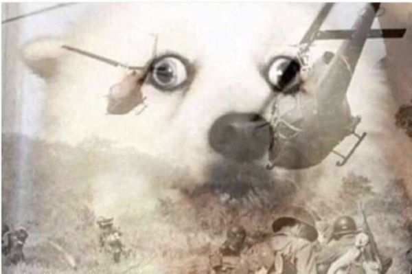
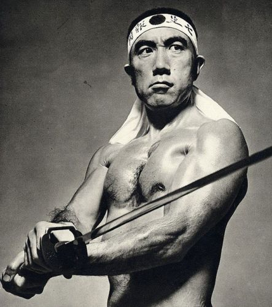
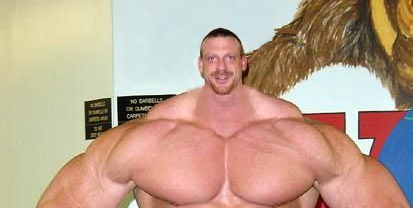

---
html:
  embed_local_images: false
  embed_svg: true
  offline: true
  toc: true

print_background: true

toc:
  depth_from: 1
  depth_to: 3
  ordered: false
---

<!-- @import "[TOC]" {cmd="toc" depthFrom=1 depthTo=4 orderedList=false} -->

<!-- code_chunk_output -->

- [Overview](#overview)
  - [Really; read this document. I promise I tried my best not to be boring](#really-read-this-document-i-promise-i-tried-my-best-not-to-be-boring)
  - [This file has too many links!](#this-file-has-too-many-links)
- [Requirements](#requirements)
  - [Integrations](#integrations)
- [FAQ](#faq)
  - [Is this compatible with...?](#is-this-compatible-with)
    - [Known compatible mods](#known-compatible-mods)
    - [Known incompatible mods](#known-incompatible-mods)
    - [Not confirmed, but should work](#not-confirmed-but-should-work)
    - [Not confirmed, but shouldn't work](#not-confirmed-but-shouldnt-work)
  - [This messes my CBBE 3BBB colors!](#this-messes-my-cbbe-3bbb-colors)
  - [My fatigue is over 9000!!!](#my-fatigue-is-over-9000)
  - [Weight gaining/getting ripped for pure mages](#weight-gaininggetting-ripped-for-pure-mages)
  - [What's the deal with the head resizing thing?](#whats-the-deal-with-the-head-resizing-thing)
  - [Could you add ripped textures for \<insert name here\> body / race / texture pack?](#could-you-add-ripped-textures-for-insert-name-here-body-race-texture-pack)
  - [I've got neck/wrist/ankle seams and weird artifacts](#ive-got-neckwristankle-seams-and-weird-artifacts)
- [The basics](#the-basics)
- [Behaviors](#behaviors)
  - [The Pumping Iron Behavior](#the-pumping-iron-behavior)
    - [Summary](#summary)
    - [Mechanics in depth](#mechanics-in-depth)
      - [Inactivity](#inactivity)
      - [Skill configuration](#skill-configuration)
    - [Status reports](#status-reports)
  - [The Sandow Plus Plus Behavior](#the-sandow-plus-plus-behavior)
    - [Summary](#summary-1)
    - [Mechanics in depth](#mechanics-in-depth-1)
      - [Fatigue](#fatigue)
  - [The Bruce Lee Behavior](#the-bruce-lee-behavior)
    - [Overview](#overview-1)
    - [Mechanics in depth](#mechanics-in-depth-2)
      - [Punishments](#punishments)
- [Everything about getting ripped](#everything-about-getting-ripped)
  - [Requirements (read before using this)](#requirements-read-before-using-this)
      - [For Men](#for-men)
      - [For CBBE](#for-cbbe)
      - [For UNP](#for-unp)
      - [About the normal map resolution](#about-the-normal-map-resolution)
  - [Downsides](#downsides)
    - [How does the player get ripped](#how-does-the-player-get-ripped)
      - [What this means for Ripped bodies users](#what-this-means-for-ripped-bodies-users)
- [Random thoughts](#random-thoughts)
  - [I love JContainers :heart:](#i-love-jcontainers-heart)

<!-- /code_chunk_output -->

<!-- @import "help.less" -->

# Overview
Thanks for using Sandow Plus Plus! \
This mod is the result of many, **MANY** hours of hard work that sometimes required deep research... and decompiling and trying to decipher how to use obscure  undocumented files that are already quite hard to come by *per se*.

<figure>

<figcaption>The horror...</figcaption>
</figure>

The basic premise behind this mod is simple: **train and sleep to get muscular/ripped**[^bsamazons].

[^bsamazons]: If you are playing as a woman and you gain boobs instead of muscles, you may want to try [my favorite Bodyslide preset ever](https://www.nexusmods.com/skyrimspecialedition/mods/34593) (which I made myself, obviously).

Nonetheless, this mod has become so complex[^performant] and has so many options it really deserves a fully fledged help file.

[^performant]: Don't worry, though. It has always been **quite performant**.
This mod only runs when you ask it to do so, and when it does, it's by performing simple mathematical formulas.

## Really; read this document. I promise I tried my best not to be boring
I always appreciate when authors take their time to explain how to use their mods and... let us be honest: I hate when they don't bother to explain how to play their complex mods and such, so here we are.

So, let me emphasize again: **Sandow Plus Plus is complex** and you should really read this document.
If you ever have a problem, I've most likely talked about it in this help file.

## This file has too many links!
... you ungrateful swine ==>:v==

It's totally done on purpose. I don't expect you to read it all sequentially.
I want to take you to the point as fast as I can, not writing the next great russian novel.

<figure>

<figcaption><i>Chapter 1, page 293</i>: And then, after pondering about the great unfathomable tragic passing of time by the intrinsecally futile altar of human ambition, Czwxnqstazky gets up so he can finally start doing some shit for today or something.</figcaption>
</figure>

# Requirements
Boring stuff, but necessary if you don't want me to ask you to enable debugging and tracing just for you to be greeted by a message telling you [***DO YOU EVEN READ, BRO?***](https://knowyourmeme.com/memes/do-you-even-lift).

<figure>

<figcaption>Why, of course I'm not joking!</figcaption>
</figure>

## SKSE + SkyUI + PapyrusUtil {ignore=true}
Required for most *must-have* mods, anyway.

## JContainers  {ignore=true}
***THIS IS NOT OPTIONAL***. I repeat: **THIS IS NOT OPTIONAL**.

Starting from v4.0 and on, this mod relies on the Lua programming language; and the only way to get Lua working in Skyrim is using ==JContainers==.

Long story short: this mod will simply fail to work if you don't use JContainers.
If you want to know the long story behind this, [read here](#i-love-jcontainers-heart).

## RaceMenu  {ignore=true}
These are required only if you want to use any feature related to getting ripped using this mod.
Sorry, ECE users, there's no way around this.

BUUUUUT... theorethically, this mod only uses the `NiOverride` part of RaceMenu (at least, that's what I programmed it for), so if you know how to use `NiOverride` without using the whole of RaceMenu, you might want to try using those *getting ripped* features and see what happens.

**Don't ask me how to do that**, though. I don't know how, I don't want to search for it[^nioverride_tired] and that's why doing so it's not oficially supported.

[^nioverride_tired]: Believe me. I've got enough of `NiOverride` just trying to get it work for this mod.
It was ***WAY WORSE*** than trying to learn how to make the damn Widget.

## Integrations
### SexLab ( ͡° ͜ʖ ͡°)  {ignore=true}
Nothing too fancy. It just considers sex scenes as physical activity so you won't lose your gains by inactivity.
Having sex won't make you muscular or ripped, since it's not physical training.

And... that's the only integration.
For now...

# FAQ
This section is actually composed of links to other parts of the document, and yes: I put it here on purpose because I know most of you won't bother to read the full guide[^prose].
[^prose]: Your loss. You won't be able to bask in my sublime prose.
## Is this compatible with...?

If your mod isn't here, you could try and tell us.
No way I can try every single mod in existence. I want to play this game too!

### Known compatible mods

* [Wet Function Redux](https://www.loverslab.com/files/file/9467-wet-function-redux-se/). Fuck yeah! [^wet_funct_fact].

  [^wet_funct_fact]: Little fun story time:
  After more than 2 months working (daily) on getting ripped I had at last a fully working method for it, but then I realized it totally conflicted with this mod.
  Since this is one of my favorite mods ever, I had to found a workaround... that lead me to the current -more compatible- method.

* [Ripped Bodies](https://www.nexusmods.com/skyrimspecialedition/mods/34632). Of course it this; I made it myself as a companion mod for this one.
  You still need to download the textures for both Sandow Plus Plus and Ripped Bodies, even if they are pretty much the same. [See here why](#how-does-the-player-get-ripped).

  If NiOverride ever fixes NPC overlays problems, you bet Ripped Bodies will become irrelevant, but for the time being both are needed for making player and NPCs ripped.

### Known incompatible mods
* [Pumping Iron](https://www.nexusmods.com/skyrimspecialedition/mods/13434)... obviously (see [Not confirmed, but shouldn't work](#not-confirmed-but-shouldnt-work)).

### Not confirmed, but should work
* Any custom race should work right off the bat for weight gaining.
  When it comes  to getting ripped, ==[it's not as simple](#could-you-add-ripped-textures-for-insert-name-here-bodytexture-pack).==

* Any mod that does something based on your weight (but doesn't actually change it).

### Not confirmed, but shouldn't work
* Any mod that changes your body weight.
  **Even CTDs where reported** when using this and Pumping Iron both together.

* **Many mods that change textures on character's bodies** are expected to conflict with this mod.
Hopefully nothing game breaking, but certainly getting both them and mine fighting over who sets which textures, ending up with funny looking characters.
  I can't anticipate which mods will and which won't work. If you find one of those, please tell us all.

* Any mod using Racemenu's body overlay layers 0 and 1 [when you are using any method for getting ripped](#downsides) from this mod.
  You should see your character's body flickering because both mods are setting their own textures or mine simply overriding changes made by others.

## This messes my CBBE 3BBB colors!

That's not a question >:v

Anyway, **when** this happens:

<figure>

<figcaption>Wetness was added because I was testing this mod properly worked along Wet Function Redux</figcaption>
</figure>

You should open the console, write `Showracemenu`[^change_of_face] and then reset your skin color.

[^change_of_face]: Or even better, just use [A Change of Face](https://www.nexusmods.com/skyrimspecialedition/mods/10508).

Don't worry though. ==This only happens when starting a new game==.

## My fatigue is over 9000!!!
Dude... you are an old meme and you were never funny to begin with.

<figure>

</figure>

That being said, yes: that is expected if you don't sleep well.

Remember Sandow Plus Plus is easygoing as long as you don't break its rules.

## Weight gaining/getting ripped for pure mages
Yes, there's full support for that.
Brains and brawns have never been mutually exclusive in real life.

<figure>

<figcaption>Case in point: Yukio Mishima.</figcaption>
</figure>

You can always train with ==weight sacks== when normal adventuring just doesn't make the cut.

## What's the deal with the head resizing thing?
Avoiding this:

<figure>

</figure>

Also, opening the door to darkness.
I totally expect people[^boob_asking] asking me to make boobs and glutes bigger by using that marvelous technology.

[^boob_asking]: That could be even you!

## Could you add ripped textures for \<insert name here\> body / race / texture pack?
Fun fact: did you know that, compared to most of the Skyrim player base, we may be as well be considered some fetishist weirdos?

<figure>

<figcaption>This is what the average Skyrim player actually finds sexy.</figcaption>
</figure>

Sadly, [normal textures](https://en.wikipedia.org/wiki/Normal_mapping) to make characters look ripped aren't easy to come by.
Granted, it's not the same desolate panorama it was 6 years ago, but it's still a long way from ideal.

When I search for some texture set, I shit you not, the very first thing I look for is for it having ripped textures.
So, [the textures I've supplied](#texture-sets) are the best of the best: they all are **great texture sets that happen to have many levels of muscle definition**.
Even so, they're not always suitable to be used for this mod.

Take for example, Leyenda. They are my favorite textures ever and they've got many ripped options... but their options don't transition too well from not ripped to ripped (what this mod actually needs), so I had to manually alter them using ==Fitness Body== (yeah, it's for LE) so they could correctly blend from zero to hero... something I can't do for UNP, since Fitness Body only comes with textures for CBBE[^unp_motiv].

[^unp_motiv]: And you can bet your ass I don't have the motivation to try to do them anyway, since you know... I don't use UNP.

<figure>
<!--  -->
<video width="300" height="300" src="img/normal.mp4" preload="none" autoplay="autoplay" loop="loop">
  Dude... if you can't watch this is because you are still using Internet Explorer... in 2020!
  </video>
<figcaption>Your textures must blend like this to be useful for this mod.</figcaption>
</figure>

The take on: if you know about **a texture set that already includes some levels of muscle definition** I still can see what I can do. If not, forget about it.
Please keep this in mind before asking me to add support for your furries.

You and I are weird compared to most Skyrim players. We are short on options, anyway.

## I've got neck/wrist/ankle seams and weird artifacts
That's because you aren't using the correct [the texture sets](#texture-sets).

# The basics
- Every time a certain skill goes up, you get `Training`, which transforms to weight/muscle definition when you sleep.
- So, train and sleep to gain weight.

<!-- ... or you could get `training` that converts to `muscle definition`.

It's mostly the same, it just has different names because I originaly made this mod for only altering bodyweight, so I thought the term `weight Gain Potential` was better, but then came along  -->

The basics are quite simple, so now let's talk about the complex stuff.

# Behaviors
@import "html/bhv-table.html"

Behaviors are rules to play this mod. The game feels quite different depending on which you choose.

To change the current Behavior, just select one from the MCM.

Let us start with the simplest and the one you are most likely accustomed to, since it's the most popular weight gaining mod in Skyrim.

## The Pumping Iron Behavior
When selecting this, you will get the exact same functionality you would expect from [Pumping Iron](https://www.nexusmods.com/skyrimspecialedition/mods/13434)[^thanks_Gopher], but you will also get all the ==quality of life additions native to this mod==.

[^thanks_Gopher]: Thanks to Gopher for graciously giving me permission for using his method!

### Summary
@import "html/bhv-pi.html"

### Mechanics in depth
Train, then go to sleep when the time is right. \
You need to train constantly because you lose 10% WGP each day.

For each hour slept in a row, you gain 0.1% WGP by default, up to 1% for 10 or more hours.\
You need to wait 12 hours before you can gain WGP again by sleeping.

The main idea here is training quite frecuently and that's how this Behavior feels.

That's probably what you already know, so let's see the new additions by this mod.

#### Inactivity
You can lose WGP by inactivity if the option to lose WGP is checked. Right now that's the only way to lose weight using this Behavior[^pi_lose].
The weight loss rate is 1% a day after 42 hours of not leveling up any skill that contributes to your weight.

[^pi_lose]: You don't want more ways to lose weight; going from 0% to 100% is already quite hard.

***Be warned***: those days are counted starting from the last time you trained. So if you haven't trained for 42 hours, you will lose 1.75% right off the bat.

Yeah, the inactivity window before you start to see losses is quite short.\
weight loss didn't exist in the original Pumping Iron, so I tweaked the time expecting to stay true to the feeling of playing Pumping Iron[^pi_gym_rats].

[^pi_gym_rats]: That is, feeling like all gym rats feel when they want to kill themselves because skipping just one training day could set back their gains.

#### Skill configuration
You can't configure your skill contribution to WGP because there's nothing stopping you from cranking everything up to max and make this a really boring mod[^pi_skills].\
You will still get training from ==Sneak, Alteration and Restoration, though==.

[^pi_skills]: In the Sandow Plus Plus behavior doing that would lead to overtraining, but not here.

Still, this Behavior's gains can be tweaked using the ==oççueauuaouadiudeeidud== so this Behavior can become even harder[^pi_harder] or you can get the easy route and set it up to gain up to 300% a day.\
That option was added so you could better differentiate how much time it takes men to be a mountain of muscles and women to have ~~bigger tits~~ way less muscle development, not to cheat... but I won't blame you if you want to use it to cheat in this Behavior.

[^pi_harder]: Why would anyone want THAT???

Because of its mechanics, in the original Pumping Iron mod it was already difficult going from zero to hero even as a pure warrior; going as a mage was simply impossible.\
This mod added ==training sacks==, so even mages can get proper training.\
Due to its playing rules, this Behavior benefits quite a lot from using them.

### Status reports
There's no fatigue in this behavior, so status reports show you messages telling you how many hours you have left before you can sleep to gain weight, instead.\
12 hours, as per Gopher design.

#### Widget  {ignore=true}
Meter 3 tells you how much time you got before you can go to sleep to gain weight.\
When it fills up to max and starts flashing it means you can now go to sleep.

Meters 1, 2 and 4 do the same for Sandow Plus Plus and Pumping Iron.

## The Sandow Plus Plus Behavior

This is the behavior I originally created to use instead of [Pumping Iron](#the-pumping-iron-behavior).

The idea here is to naturally gain weight without worrying too much about not reaching the training requirements to go from 0% to 100% weight.

### Summary

| | Sandow Plus Plus|
|-|-|-|-|-|
|**Type**| weight gaining|
|**Philosophy**| <ul><li>Fatigue managment.</li><li>Relaxed weight gaining.</li></ul> |
| **How does it feel to play?** | *"It's natural for an adventurer to be muscular"*. |
| **Rewards you when you...** |<ul><li>Sleep and train however you want. Just get enough of both.</li></ul>|
|**Punsihes when you...**| <ul><li>Don't sleep enough.</li><li>Don't train for 3 days.</li><li>Overtrain.</li></ul> |
|**Overview**| Easygoing and natural way to play, but a harsh misstress. It's hard to get punished, but you'll regret it if that happens. Gameplay is ideal for people that just want to grow. |

### Mechanics in depth
Go around doing your own business to earn weight and just go to sleep when you are fatigued. That weight gets converted to weight if conditions are right.

- Gaining and losing weight is controlled by your fatigue. If you go to sleep with little fatigue, you'll only grow a little. Get too much fatigue and you'll start to lose WGP and maybe even weight!
- Your gains can be affected by the law of diminishing returns: the more muscular you are, the harder is to get even more muscular (just like in real life). The opposite holds true. You can enable or disable this feature at will.
- Sleep however you want; just get enough of it. No penalties for badly timed or short sleeping sessions.

#### Fatigue
This behavior is all about **fatigue management**.

You'll only lose `WGP` if you go to sleep when your fatigue is above 90%. If your fatigue is 100% or above you'll also lose weight instead of gaining it (can be disabled in the MCM menu).

weight gain is controlled by how much hours you sleep a day, but it's also controlled by fatigue. **For best results, go to sleep 10 hours when you are somewhat fatigued** (around 70% - 89.99%).
Sleeping more than 10 hours won't do anything for weight gaining, since your weight gaining capabilities cap at 10 hours.
Of course, nothing stops you from sleeping 15 hours a day if it's more convenient to you. As I said, fatigue controls your gains, not time.

Always remember that **weight gaining depends on your WGP, how much you sleep and your fatigue**. You can certainly try to get cute and sleep 10 hours, wait 1 hour and then sleep again 10 hours, but you'll notice you won't gain as much as sleeping 10 straight hours when you are actually fatigued.

Fatigue builds two ways: over time and by leveling up skills.
Every single second awaken (in game time) you are getting fatigued. Also, each time you level up a skill that gives you WGP you get fatigued.
That means you'll get fatigued faster after a hard workout day compared to a shopping spree day.

## The Bruce Lee Behavior

In this behavior your weight won't change at all, but your muscle definition will.
Before using it, make sure to read [its requirements](#requirements-read-before-using-this) and [downsides](#downsides).

### Overview
The general idea here is to get a sample taste of what a chore it is to be ripped in real life[^annoying_ripped].
[^annoying_ripped]: But it's not as hard and annoying as real life, though.

Like in real life, **you must be active at all times** to get ripped and [you will be punished in real time](#punishments), unlike weight gaining methods, where you are only punished at sleeping time.

As usual, you will get your gains after sleeping and they are capped after 10 hours of sleeping.
Ten hours sleeping converts to 1% training to muscle definition. Four hours sleeping converts 0.4% training to muscle definition.

Unlike other behaviors, your gains depend on how much do you weight; with lower weights gaining more muscle definition for the same amount of training... but lower weights are also punished harder[^irl_ripped_loss].

[^irl_ripped_loss]: That was made to simulate the fact that in real life having muscles makes ***QUITE*** difficult to get ripped (at least, without losing them in the process... why do you think steroids are so popular?) but also give you some leeway to eat and train like shit because they are expending calories just for being there.

### Mechanics in depth

#### Punishments
Inactivity and lack of sleep will both punish you; both in real time.

What does that mean? That if you are being punished you will actually see the ==Widget== flashing red[^red_widget_lossing] and you may even watch how your hard gained abs are disappearing while playing!

[^red_widget_lossing]: Which is always a signal that you are losing something.

==That's a completely different approach to how weight gainind methods work, which apply calculations only when sleeping.
On those behaviors you can always reach the inactivity time but also avoid losses if you train just before sleeping, and that's because losses are actually calculated <u>after sleeping</u>, but now **you are really compelled to be active at all times**.== <-- Thinking about correcting that...

# Everything about getting ripped

## Requirements (read before using this)
PapyrusUtil and Racemenu are required. [I don't know how to separate NiOverride from RaceMenu](#racemenupapyrusutil), but if you know how, maybe you can use this with ECE.

### Texture sets {ignore=true}

You will need these textures sets, otherwise you may get [seams and weird artifacts](#ive-got-neckwristankle-seams-and-weird-artifacts).

#### For Men
* [Tempered Skins for Males](https://www.nexusmods.com/skyrimspecialedition/mods/7902).
* [Masculine Khajiit Textures](https://www.nexusmods.com/skyrimspecialedition/mods/186) (for [SOS](https://www.nexusmods.com/skyrim/mods/70481)). Select `Abs textures` when installing.
* [Masculine Argonian Textures](https://www.nexusmods.com/skyrimspecialedition/mods/185) (for [SOS](https://www.nexusmods.com/skyrim/mods/70164)). Select `Heavy Scales textures` when installing.

SOS Light not supported.

#### For CBBE
* [Leyenda Skin](https://www.nexusmods.com/skyrimspecialedition/mods/10306).
* [Feminine Khajiit Textures](https://www.nexusmods.com/skyrimspecialedition/mods/183). Select `Abs textures` when installing.
* [Feminine Argonian Textures](https://www.nexusmods.com/skyrimspecialedition/mods/184). Select `Heavy Scales textures` when installing.

#### For UNP
* [Tempered Skins for Females](https://www.nexusmods.com/skyrimspecialedition/mods/8505).
* [Feminine Khajiit Textures](https://www.nexusmods.com/skyrimspecialedition/mods/183). Select `Abs textures` when installing.
* [Feminine Argonian Textures](https://www.nexusmods.com/skyrimspecialedition/mods/184). Select `Heavy Scales textures` when installing.

[Read this](#could-you-add-ripped-textures-for-insert-name-here-bodytexture-pack) if you want to know why only these are supported.

All credits to their wonderful authors, who graciously gave me permission to distribute their hard work.

* [HeroedeLeyenda](https://www.nexusmods.com/skyrimspecialedition/users/7960590).
* [MONSTERaider](https://www.nexusmods.com/skyrimspecialedition/users/1630457).
* [traa108](https://www.nexusmods.com/skyrimspecialedition/users/9916407).
  **Honorable mention**. He went the extra mile and even gave me a file and method to modify muscle definition!

#### About the normal map resolution
The textures I provide are so *"low resolution"* for performance and size reasons.

It may seem odd to use 1K textures nowadays, when 4k are kinda common place (and some people use even 8K!), but low normal map resolution in this particular kind of textures is not as evident as low diffuse or specular.

So, if you are the kind of person that gets obsessed with texture resolutions, you better download hi res furniture/rocks/terrain/whatever instead of wasting memory and processing time by using large textures that won't look too different to smaller ones anyway.

## Downsides
These are known unavoidable issues you should read before getting too excited about this features:

* Racemenu's `NiOverride` is used. Specifically, `hand overlay layer 0`. ***There's no other way around***.
  This means this is incompatible with any mods that use that layer themselves or tattoos you are using on those layers (meh... who cares about hand tattoos, anyway?).

You can easily solve the body tattoos issue by applying them on other layers, but the other one is just impossible to solve.

If you really want to use whatever mod that irremediably conflicts with this[^slave_tattoos], make sure not to use [the Bruce Lee Behavior](#the-bruce-lee-behavior) and not using any of the ==options to make the player ripped==.

[^slave_tattoos]: I don't know about any. Maybe Slave Tattoos, but I don't personally use it.

* You need to use textures. ['Nuff said](#texture-sets).

* In order to be more compatibile with certain body mods and armors, **you can't use skin colors `FFFFFF` nor `000000`** (ie, totally white nor totally black).
If you really want to use one of those colors (who the hell does that?), you can use `FFFFFE` or `000001`. Your human eyes won't notice the difference, but your computer does :grin:.

* ~~Doesn't work on NPCs and there's no way to do it because `NiOverride` doesn't work to well on them (remember it's still in alpha stage for SE).
  If you want ripped NPCs you may want to try using [Ripped Bodies](https://www.nexusmods.com/skyrimspecialedition/mods/34632), by yours trully. It's way less complex than this, but gets the job beautifully done and [it's fully compatible](#known-compatible-mods) with this mod.~~

* ~~Everytime you un/equip your armor your character will briefly flicker and you may even see a purple texture flash. Again, no way to avoid this.~~

### How does the player get ripped
With scripts.

<figure>
<video width="500" height="213" src="img/worst-acting.mp4" preload="none" autoplay="autoplay" loop="loop">
  Dude... if you can't watch this is because you are still using Internet Explorer... in 2020!
  </video>
<!--  -->
<figcaption>Heh...you just pissed on your pants.</figcaption>
</figure>

These scripts find which race the player is and then applies  textures associated with it... if such race is known for the script, of course.
**Only two textures are used**: the least and the most ripped.

The least ripped texture is set on `Body Overlay Layer 0`, while the most ripped one is set on `Body Overlay Layer 1` with some transparency.
This transparency is the one thing that controls how ripped you look. At 0% you will look like the `Body Overlay Layer 0`. At 100% you will totally look like `Body Overlay Layer 1`.

#### What this means for Ripped bodies users
Sandow Plus Plus only needs 2 textures, while [Ripped Bodies](https://www.nexusmods.com/skyrimspecialedition/mods/34632) uses 6.
I won't bore you with technical details; just accept the fact that more textures are needed when not using scripts.

The thing is, even though both mods mostly use the same set of textures, but I'm a bit indecisive on using exactly the same installation for both, and here's why.

@import "html/pro-con-textures.html"

# Random thoughts

## I love JContainers :heart:

Version1 4.0 is one of my favorites because it adds way too much functionality, drops unnecessary shit that was bloating this mod and **it also was quite a challenge**.
Not only it adds too much new functionality, but I also basically rewrote all what I could in Lua thanks to JContainers.

*"Rewriting this mod in Lua"* may not tell you much if you aren't a programmer, but that basically means more flexibility to make more awesome things more easily (I'll finally get to implement the food system because it will be less of a chore, for starters).

For example, the [Bruce Lee Behavior](#the-bruce-lee-behavior) is a cascade of exponential curves working together that took around 200 lines of effective code.
A first (and quite buggy) approach using Papyrus took 130 lines and it wasn't even half finished and not as easy to maintain and debug! It was most likely bound to be at least 350 lines of real code.
In fact, it was its bugginess what pushed me to try using Lua instead of Papyrus.

All of that sounds great, but there are always trade-offs, and it this case, the trade-off is that new implementation irremediably breaked everything I did before.
That's why that version took so much time to be released.

Anyway, from now on I think I'll release all my mods with JContainers as a requirement.
It's such a smooth motherfucker.
